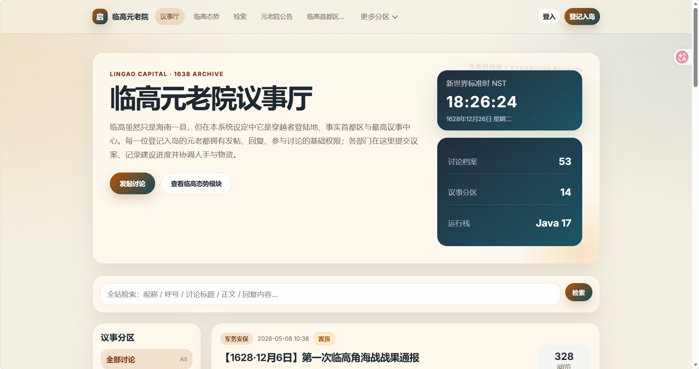
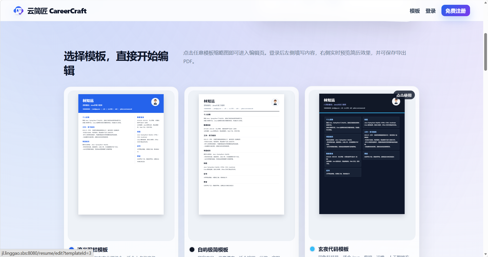
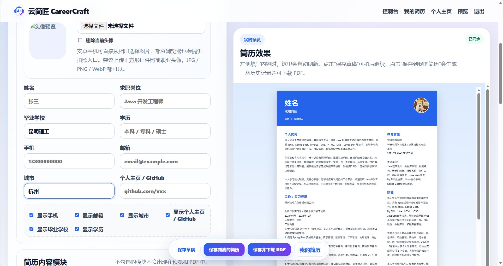

# 临高元老院 BBS v2

一个“穿越者元老院”题材的 Java + MySQL 论坛工程，基于 Spring Boot、Thymeleaf、Spring Data JPA 和 MySQL 实现。

本版本重点升级了数据库：不再只是简单的用户、帖子、评论三四张表，而是按长期运营论坛设计，预留了权限、标签、收藏、通知、附件、审计日志、登入日志等能力。


## 项目效果图

> 以下图片已统一放在项目根目录的 `screenshots/` 文件夹中，并重命名为不重复的英文文件名，方便 GitHub README 直接展示。

| 效果图 | 预览 |
| --- | --- |
| 效果图 1 |  |
| 效果图 2 |  |
| 效果图 3 |  |


## 功能

当前已实现：

- 用户注册、登入、退出
- 发起讨论、讨论详情、元老回复
- 分区筛选、关键词检索
- MySQL 持久化
- 后台管理：档案概览、身份管理、议案置顶/删除、回复删除、分区新增/编辑/删除
- 默认穿越者主题分区：元老院公告、工业建设、农业与物资、医疗卫生、军务安保、航海贸易、教育档案、政务制度

数据库已预留：

- 多角色权限 RBAC：`bbs_roles`、`bbs_user_roles`
- 分区层级：`bbs_categories.parent_id`
- 主题帖正文拆表：`bbs_threads` + `bbs_thread_contents`
- 楼中楼回复：`bbs_replies.parent_id`
- 标签：`bbs_tags`、`bbs_thread_tags`
- 点赞 / 反应：`bbs_reactions`
- 收藏：`bbs_bookmarks`
- 站内通知：`bbs_notifications`
- 附件：`bbs_attachments`
- 后台审计：`bbs_audit_logs`
- 登入日志：`bbs_login_logs`

详细说明见：

```text
DATABASE_DESIGN.md
```

完整建库 SQL 见：

```text
docs/database-v2.sql
```

旧版迁移参考 SQL：

```text
docs/migration-from-v1.sql
```

## 环境要求

- JDK 17
- Maven 3.6.3+
- MySQL 8.x 推荐

## 创建数据库

新版默认使用新库名：

```sql
CREATE DATABASE IF NOT EXISTS qiming_bbs
  DEFAULT CHARACTER SET utf8mb4
  DEFAULT COLLATE utf8mb4_unicode_ci;
```

不建议继续混用旧的 `modern_bbs`，因为新版表结构已经重构。

## 修改数据库配置

打开：

```text
src/main/resources/application.yml
```

修改你的 MySQL 账号密码：

```yaml
spring:
  datasource:
    url: jdbc:mysql://127.0.0.1:3306/qiming_bbs?createDatabaseIfNotExist=true&useUnicode=true&characterEncoding=utf8&useSSL=false&allowPublicKeyRetrieval=true&serverTimezone=Asia/Shanghai
    username: root
    password: 你的MySQL密码
```

## 管理员账号

第一次启动时会自动创建管理员账号：

```text
用户名：admin
密码：admin123456
后台地址：http://localhost:8080/admin
```

可以在 `application.yml` 里修改默认管理员：

```yaml
app:
  admin:
    default-username: admin
    default-password: admin123456
    default-nickname: 执委会管理员
```

如果你已有自己的账号，也可以在 MySQL 执行：

```sql
USE qiming_bbs;
UPDATE bbs_users SET role = 'ADMIN' WHERE username = '你的用户名';
```

## 启动

```bash
mvn clean package
java -jar target/modern-bbs-1.0.0.jar
```

或者：

```bash
mvn spring-boot:run
```

前台地址：

```text
http://localhost:8080
```

后台地址：

```text
http://localhost:8080/admin
```

## 你通常要改哪里

### 1. 数据库账号密码

```text
src/main/resources/application.yml
```

### 2. 论坛名字和导航文案

```text
src/main/resources/templates/fragments.html
```

搜索 `临高元老院`、`议事厅`、`登记入岛` 改成你自己的名字。

### 3. 首页介绍

```text
src/main/resources/templates/index.html
```

可以改首页大标题、简介、按钮文字、搜索框提示语。

### 4. 分区名称

```text
src/main/resources/data.sql
```

这里是默认分区。项目启动时会自动写入/更新到数据库。

### 5. 页面配色和风格

```text
src/main/resources/static/css/app.css
```

主要改开头的 CSS 变量。

### 6. 后台页面文案

```text
src/main/resources/templates/admin/
```

后台有身份管理、议案管理、回复管理、分区管理页面。

## 数据库为什么这样设计

核心思路：

1. **主题帖正文拆出去**：列表页只查 `bbs_threads`，不把长正文一起读出，数据多了以后更稳。
2. **回复独立为 `bbs_replies`**：以后能做楼中楼、楼层号、隐藏、审核。
3. **权限预留 RBAC**：现在仍可用 `role` 字段，后续可升级成多角色、多权限。
4. **状态字段不物理删除**：用户、帖子、回复都有 `status`，以后可以做封禁、隐藏、审核、恢复。
5. **统计字段提前预留**：帖子数、回复数、浏览数、点赞数不需要每次 COUNT，大流量时更省。
6. **审计和日志提前留表**：后台操作、登入行为以后能追踪，适合长期运营。

## 从旧版迁移

如果你之前用了旧版 `modern_bbs`，建议先创建新库 `qiming_bbs`，运行新版项目一次，然后参考：

```text
docs/migration-from-v1.sql
```

迁移旧用户、旧帖子、旧回复。

## 常见问题

### 启动时报 Unknown database 'qiming_bbs'

先执行：

```sql
CREATE DATABASE IF NOT EXISTS qiming_bbs
  DEFAULT CHARACTER SET utf8mb4
  DEFAULT COLLATE utf8mb4_unicode_ci;
```

### 中文分类显示乱码

确认 `application.yml` 里有：

```yaml
spring:
  sql:
    init:
      encoding: UTF-8
```

### 想继续用旧数据库 modern_bbs

可以把 `application.yml` 里的：

```text
qiming_bbs
```

改回：

```text
modern_bbs
```

但旧库里有旧表结构，可能需要手动迁移或清理，所以更推荐新库。


## 新增：临高态势图

首页只显示新世界时间；元老数量与地图已经移到独立“临高态势模块”，包含：

- 新世界标准时（NST）动态时钟，默认 1638 年左右
- 亚洲元老分布地图
- 全国各省份元老分布地图
- 临高首都区—南海核心驻点图

地图数据已放入 MySQL；后台修改入口：`http://localhost:8080/admin/command`。

如需修改地图样式与布局，请编辑：

```
src/main/resources/static/css/app.css
```

## 本版新增：数据库化的新世界时间与元老分布

本版把首页态势图的数据从静态 JS 改为 MySQL 数据表：

- `bbs_site_settings`：保存新世界时间设置，例如 `new_world_utc_offset_hours` 和显示名称。
- `bbs_council_locations`：保存管理员设置的亚洲 / 全国各省份元老数量基数；态势模块地图会把这里的基数和个人主页登记数相加。
- `bbs_users.station_scope`、`bbs_users.station_name`、`bbs_users.station_elder_count`：保存个人主页里的驻点和同行元老数量。

后台入口：

```text
http://localhost:8080/admin/command
```

可以修改：

- 新世界标准时名称
- 新世界历史时间
- 亚洲元老数量
- 全国各省份元老数量
- 是否在态势模块地图显示

个人主页入口：

```text
http://localhost:8080/profile
```

可以修改：昵称、头像、所属部门、职能专长、档案简介、驻点范围、驻点名称、同行元老数量。修改后会叠加进态势模块地图统计。

注意：地图现在是内置离线渲染，不依赖外部 CDN。亚洲图建议用英文国家名，例如 `China`、`United States`、`Singapore`；中国地图用中文省份简称，例如 `海南`、`广东`、`台湾`。

## 新世界时间、元老分布地图、临高核心态势图

首页已经改成数据库驱动：

- 新世界标准时：来自 `bbs_site_settings`
- 亚洲 / 全国元老分布：来自 `bbs_council_locations`
- 临高首都区—南海核心驻点图：来自 `bbs_council_locations.scope = 'STRATEGIC'`
- 个人主页登记的驻点人数会自动叠加到同名地图节点

后台入口：

```text
http://localhost:8080/admin/command
```

可以修改：

```text
新世界时间名称
新世界历史时间
亚洲地图 WORLD
中国地图 CHINA
临高核心图 STRATEGIC
```

个人主页入口：

```text
http://localhost:8080/profile
```

驻点范围可选：

```text
CHINA：海南、广东、台湾、福建等中国省份图
WORLD：China、South Korea、Singapore 等亚洲图
STRATEGIC：临高首都区 / 登陆点、百仞城政务区、博铺港、海南主基地、广东工业转运区、台湾观察与技术联络点、济州岛远洋联络点等临高核心图
```

地图已经改成内置离线渲染，不再依赖 ECharts CDN，所以不会因为网络问题空白。

旧库升级时可以执行：

```sql
USE qiming_bbs;
SOURCE D:/github/modern-bbs/docs/upgrade-hainan-strategic-map.sql;
```


## Windows MySQL 中文 SQL 执行说明

如果执行 `SOURCE docs/upgrade-hainan-strategic-map.sql` 时出现：

- `Data too long for column 'name'`
- `Incorrect string value`

请使用 UTF-8 方式登录 MySQL：

```powershell
mysql --default-character-set=utf8mb4 -uroot -proot
```

进入后执行：

```sql
SOURCE D:/github/modern-bbs/docs/fix-hainan-sql-error.sql;
```

修复脚本会自动 `CREATE DATABASE qiming_bbs`、`USE qiming_bbs`、扩大地图地点名称字段，并重新导入海南、广东、台湾、济州岛等核心驻点。

## 1638 年新世界时间与亚洲临高态势模块

本版本已调整为：

- 首页只显示新世界时间，不再直接显示元老数量和地图。
- 新世界时间默认约为 `1638-05-06 08:00`，管理员可在后台直接修改历史年月日和时分。
- 元老分布数量单独放在 `/command-map` 模块中查看。
- 元老默认全部分布在亚洲，重点包含海南、广东、台湾、济州岛、越南、日本等节点。

后台修改入口：

```text
http://localhost:8080/admin/command
```

前台态势模块入口：

```text
http://localhost:8080/command-map
```

如果你已经运行过旧版本数据库，建议在 MySQL 中执行：

```sql
USE qiming_bbs;
SOURCE D:/github/modern-bbs/docs/upgrade-1638-asian-command-module.sql;
```

Windows 命令行建议这样进入 MySQL，避免中文乱码：

```powershell
mysql --default-character-set=utf8mb4 -uroot -proot
```

## 本版新增：临高首都区 / 登陆点设定

本版本把“临高”从普通海南县级地点提升为穿越者登陆地、事实首都区和最高议事中心：

- 首页只显示 1638 年左右的新世界时间，不显示元老数量。
- 元老数量与地图进入独立模块：`/command-map`。
- 临高核心图新增：`临高首都区 / 登陆点`、`百仞城政务区`、`博铺港`、`海南主基地`。
- 新注册的普通元老默认拥有发帖、回复、参与讨论权限。
- 新注册元老默认驻点为：`STRATEGIC / 临高首都区 / 登陆点`。
- 后台可在 `/admin/command` 修改临高、海南、广东、台湾、济州岛、越南、日本等驻点数量。

旧数据库升级请执行：

```sql
USE qiming_bbs;
SOURCE D:/github/modern-bbs/docs/upgrade-lingao-capital-module.sql;
```

Windows 命令行建议这样进入 MySQL，避免中文乱码：

```powershell
mysql --default-character-set=utf8mb4 -uroot -proot
```


## 本版新增：临高首都区与通信规则

- 临高在设定中是穿越者登陆地、事实首都区和最高议事中心。
- 每位注册元老默认都可以发帖、回复和参与讨论。
- 个人主页不再显示邮箱，改为显示所属部门、职能专长、驻点、部署类型和通信方式。
- 驻点为“临高首都区 / 登陆点、百仞城政务区、博铺港”的元老显示“单片机手机内网”。
- 广东、台湾、济州岛、越南、日本等外驻元老显示“电报联络”。
- 旧数据库可执行：`SOURCE D:/github/modern-bbs/docs/upgrade-lingao-communications-profile.sql;`

## 本版新增：执委会发帖权限、图片与基础防刷

### 1. 元老院公告权限

更符合论坛设定的做法是：不是整个论坛都只能执委会发帖，而是“元老院公告 / 执委会公报”这类正式分区只允许执委会代表或管理员发布。普通元老仍然可以在工业建设、农业物资、医疗卫生、军务安保、航海贸易等分区发帖和回复。

后台入口：

```text
http://localhost:8080/admin/users
```

可以把用户角色改为：

```text
普通元老 USER
执委会代表 EXECUTIVE
管理员 ADMIN
```

后台分区管理里可以勾选：

```text
仅执委会代表 / 管理员可以发帖
```

### 2. 帖子插入图片

发帖页面支持上传多张图片，上传后系统会自动插入到正文末尾。正文也支持这种格式：

```text

```

图片默认保存在：

```text
uploads/posts/
```

### 3. 头像上传

个人主页支持上传头像图片，也可以继续填写头像 URL。上传头像默认保存在：

```text
uploads/avatars/
```

### 4. 基础防刷和验证码

系统增加了应用层限流：短时间请求过多、POST 过多或上传带宽过大时，会要求访问者完成验证码。

验证码入口：

```text
http://localhost:8080/captcha
```

可在 `src/main/resources/application.yml` 修改阈值：

```yaml
app:
  security:
    max-requests-per-minute: 180
    max-posts-per-minute: 20
    max-bytes-per-minute: 10485760
    captcha-valid-minutes: 30
```

注意：这个只能做应用层基础防刷。真正上线还应该配置 Nginx / CDN / WAF 的连接数限制、请求速率限制和上传大小限制。

### 5. 旧库升级

如果你已经有旧的 `qiming_bbs` 数据库，建议执行：

```sql
USE qiming_bbs;
SOURCE D:/github/modern-bbs/docs/upgrade-security-images-executive.sql;
```

Windows 命令行建议用：

```powershell
mysql --default-character-set=utf8mb4 -uroot -proot
```

## 本次更新说明：分区消息、顶部导航与档案呼号

- 首页“临高元老院议事厅”大框只在议事厅首页显示；进入具体分区后，会显示该部门负责的重要消息。
- 顶部导航分区过多时，右侧不会再被遮住；多余分区会收进“更多分区”。
- 个人档案新增“呼号”和“电报号”：临高内驻元老优先显示呼号，外驻元老优先显示电报号。
- 元老邮箱不在公开页面显示。

旧数据库升级：

```sql
USE qiming_bbs;
SOURCE D:/github/modern-bbs/docs/upgrade-department-profile-nav.sql;
```

Windows MySQL 命令行建议：

```powershell
mysql --default-character-set=utf8mb4 -uroot -proot
```

## 1628 年剧情种子数据

本整合包新增 `docs/seed-1628-lingao-story.sql`，可向数据库插入 1628 年 D日—D+95日的剧情用户、帖子和评论。

执行：

```powershell
mysql --default-character-set=utf8mb4 -uroot -proot
```

进入 MySQL 后：

```sql
SOURCE D:/github/modern-bbs/docs/seed-1628-lingao-story.sql;
```

新增剧情用户默认密码均为 `123456`，例如 `maqianzhu / 123456`。
